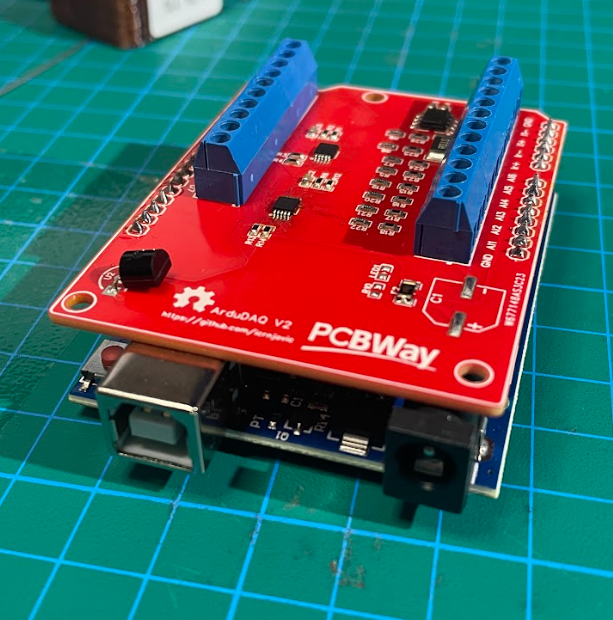
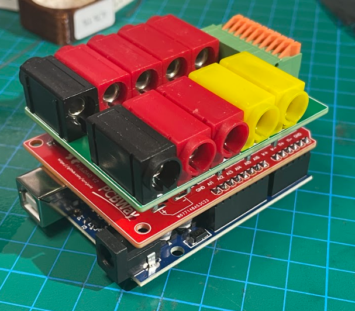
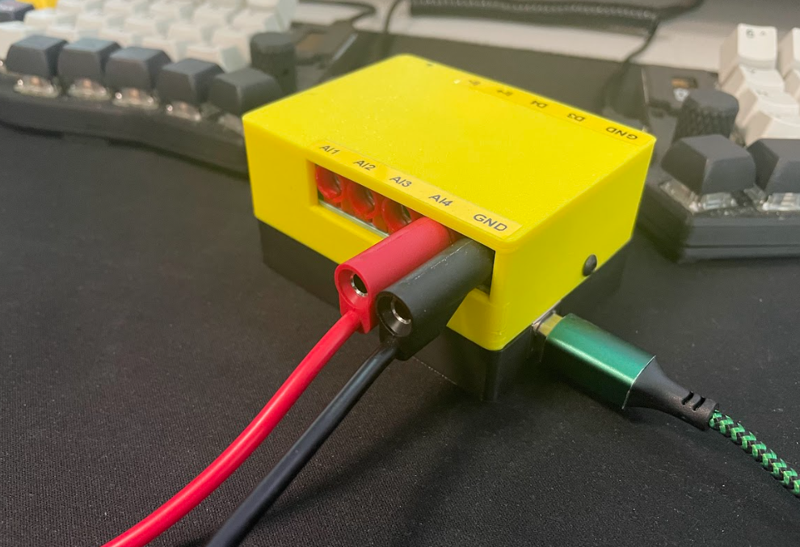
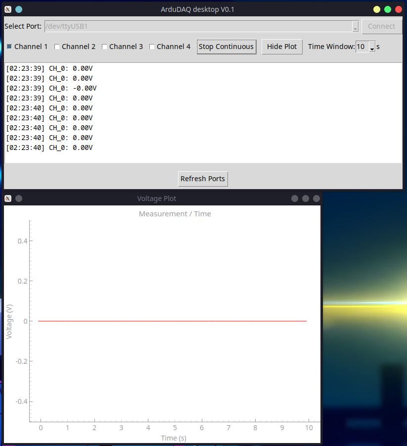
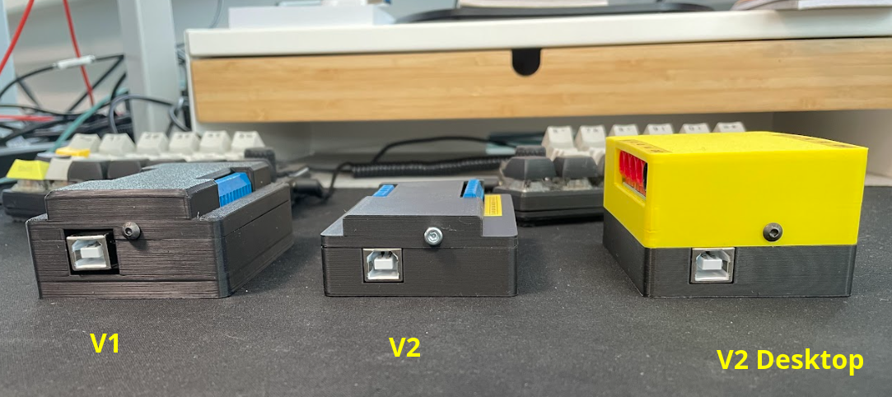

# ArduDAQ

  
  

***ArduDAQ*** is an open-source data acquisition shield for the popular Arduino platform with design to measure voltage, current, and onboard temperature with access to the rest of the pins from the base board for IO control.  
Now also comes with a stackable partner board that can turn the ArduDAQ into a bench multimeter for a more "plug and play" use directly with test probes and the companion Desktop App.   

  
  

## Sponsor
 has graciously sponsored the V2 and Desktop Carrier Board.  

The hardware for this project is open source, and you can easily order the PCBs directly from PCBWay through the following [link](https://www.pcbway.com/project/shareproject/ArduDAQ_V2_Arduino_Data_acquisition_shield_hat_7666eddc.html) without the hassle of dealing with Gerber files.  

I highly recommend their services. I’ve been using PCBWay for a long time, and they have always delivered high-quality products and excellent support.

## Specifications

| Spec            | info                                                  |
|-----------------|-------------------------------------------------------|
| Up to 8 AIN pins| By default has 6 analog inputs but can be configured up to 8. 16bit @ 860SPS.   |
| Up to 2 current channels| Hall effect based channel up to(not recommended) 5A via internal 10bit ADC. Shunt channel configurable with 16bit @ 860SPS.   |
| 7 outputs| 7 digital outputs; 4 of which are PWM pins. |
| Onboard temp.| ds18b20 offers great accuracy and is often included in arduino kits so it was chosen over the NTC route|

## Dekstop App
Alongside ArduDAQ shield's support for serial commands for automated measurements it also has a desktop app. 
It will be able to put the ArduDAQ in continuous mode to display measured voltages on selected voltage channels over time and plot those measurements. 

 

 Watch a short demo of the app: 

## Versions/releases

| Version   | HW/FW/SW   | Comments                         |
|-----------|---------|----------------------------------|
| Desktop v1| HW      | Carrier board that turrns the ArduDAQ into a more plug and play dekstop multimeter when paired with the Desktop app. Compatible with both V1 and V2 HW.|
| v2        | HW&FW   | V2 features up to 4 more 16bit input, additional current input with better low current accuracy.|
| v1        | HW      | HW fixes for IO pins             |
| Desktop app v1| SW  | PC app for reading-plotting data in real time.|
| v0.1      | HW&FW   | Initial release of ArduDAQ        |
 

## Usage & docs
For usage with examples and more details read the [documentation](docs/usage_documentation.md).
