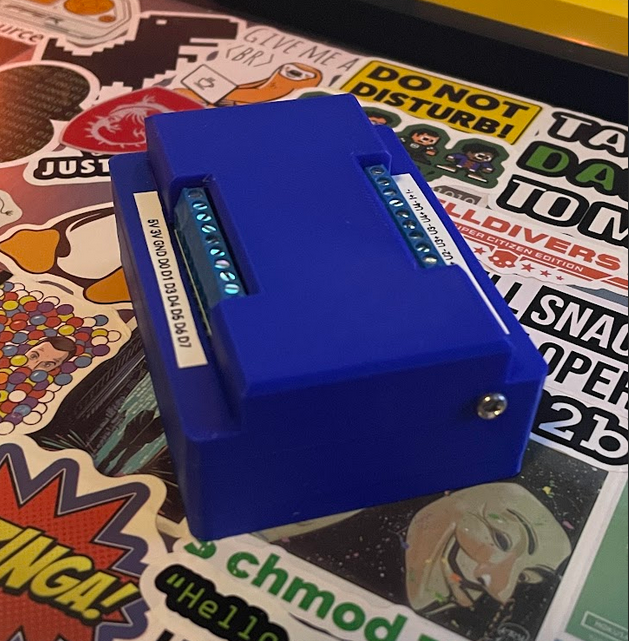
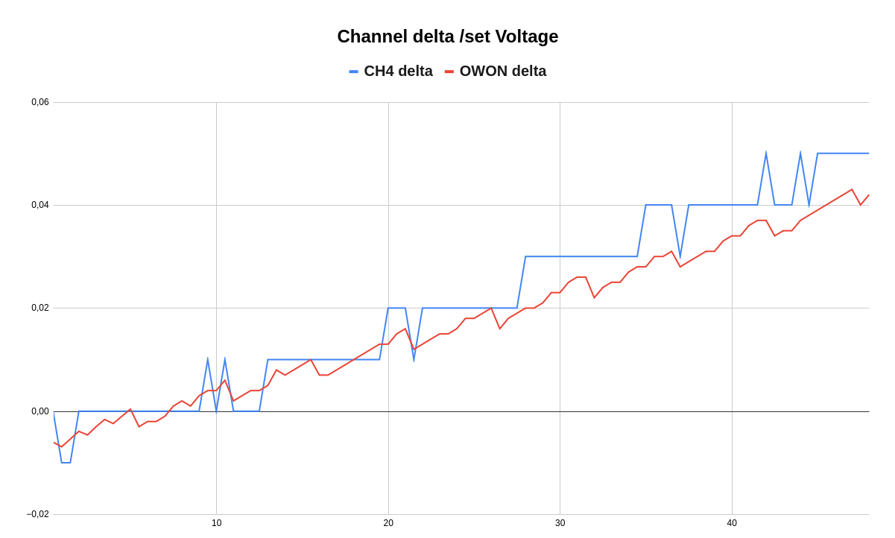
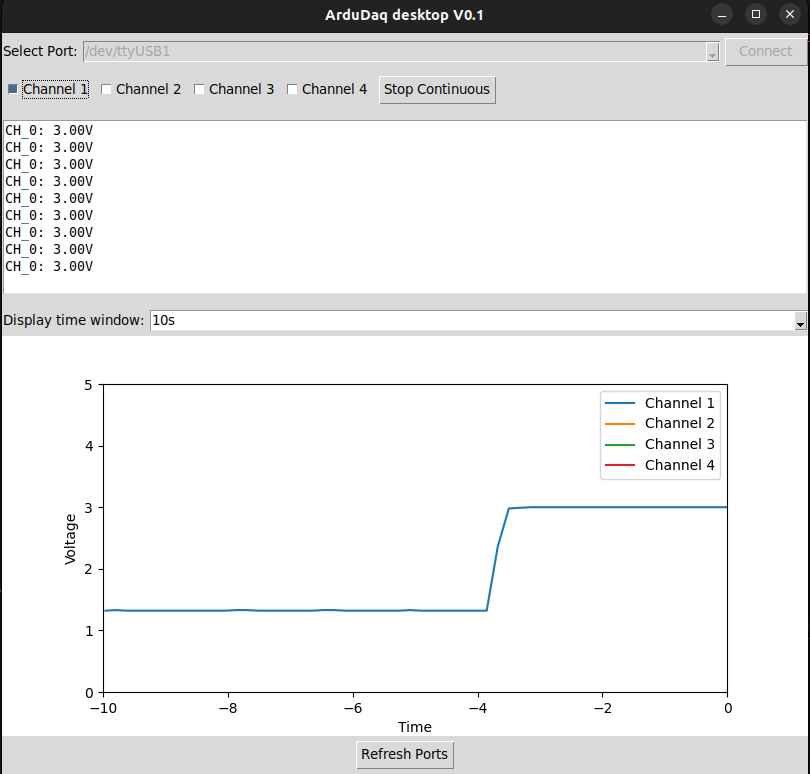

# ArduDAQ

## Project Description

ArduDAQ is an open-source data acquisition shield for the popular Arduino platform with design to measure voltage, current, and onboard temperature with access to the rest of the pins from the base board.  
It's a fun side project to get more familiar and pratice HW and SW before starting a stand alone board. Component selection is somewhat sub optimal as i wanted to use components i had on hand.

## Features

- Multiple voltage measurement channels (16 bit ADC)
- Current measurement channel (10 bit ADC - for now)
- Onboard temperature sensing
- IO (PWM included)

## Testing

| Function         | Status          | Comments            |
|--------------------|-----------------|---------------------|
| Voltage Channels   | ✅ Tested        | Initial test seems good. |
| Current Channel    | ✅ Tested        | Works relatively well but accuracy for super low currents not the best due to use of internal adc which is only 10bit.|
| Onboard Temperature| ✅ Tested  | Initital test seems good.  |
| IO | 🚧  WIP| Switching on 5/7 outputs. 2 dont work as IO due to them being Tx/Rx pins -> will be chnaged for V2 |
| Desktop APP | 🚧  WIP  | Works but needs optimizing. |

Above tests were just the basic tests on the bench.
More detailed testing will be done after the test jig is finished.

Too test the Voltage channel accuracy i teste accuracy so that I measured voltage on the PSU where i was incrementing the ouptu by 0.5V. For a reference point i was also measuring the output with a OWON XD1041 multimeter.

As seen above on the cannel i was testing the accuracy was pretty good, with a max deviation of 8mV @ 50V compared to the multimeter.

## Dekstop App
Alongside ArduDAQ shield's support for serial commands for automated measurements it also has a desktop app(***still WIP***). 
It will be able to put the ArduDAQ in continuous mode to display measured voltages on selected voltage channels over time and plot those measurements.

## Getting Started

### Serial Communication
- **Baud Rate**: 115200
- **Data Bits**: 8
- **Parity**: None
- **Stop Bits**: 1
- **Flow Control**: None

### Supported commands
| Command           | Description                           | Response Format    |
|-------------------|---------------------------------------|--------------------|
| `*IDN?`          | Request device identification         | Device identifier  |
| `MEAS:VOLT:CHAN1?`| Read voltage from channel 1          | `<value>` in V     |
| `MEAS:VOLT:CHAN2?`| Read voltage from channel 2          | `<value>` in V     |
| `MEAS:VOLT:CHAN3?`| Read voltage from channel 3          | `<value>` in V     |
| `MEAS:VOLT:CHAN4?`| Read voltage from channel 4          | `<value>` in V     |
| `MEAS:CURR?`      | Read current measurement             | `<value>` in A     |
| `MEAS:TEMP?`      | Read temperature measurement         | `<value>` in °C|
| `OUTP:CHAN3 ON`   | Turn on channel 3 output             | Channel 3 ON       |
| `OUTP:CHAN3 OFF`  | Turn off channel 3 output            | Channel 3 OFF      |
| `OUTP:CHAN4 ON`   | Turn on channel 4 output             | Channel 4 ON       |
| `OUTP:CHAN4 OFF`  | Turn off channel 4 output            | Channel 4 OFF      |
| `OUTP:CHAN5 ON`   | Turn on channel 5 output             | Channel 5 ON       |
| `OUTP:CHAN5 OFF`  | Turn off channel 5 output            | Channel 5 OFF      |
| `OUTP:CHAN6 ON`   | Turn on channel 6 output             | Channel 6 ON       |
| `OUTP:CHAN6 OFF`  | Turn off channel 6 output            | Channel 6 OFF      |
| `OUTP:CHAN7 ON`   | Turn on channel 7 output             | Channel 7 ON       |
| `OUTP:CHAN7 OFF`  | Turn off channel 7 output            | Channel 7 OFF      |

### Example Usage

To read the voltage on Channel 1, send the command `MEAS:VOLT:CHAN1?` over serial. Board will respond with a message like: `3.30V`

